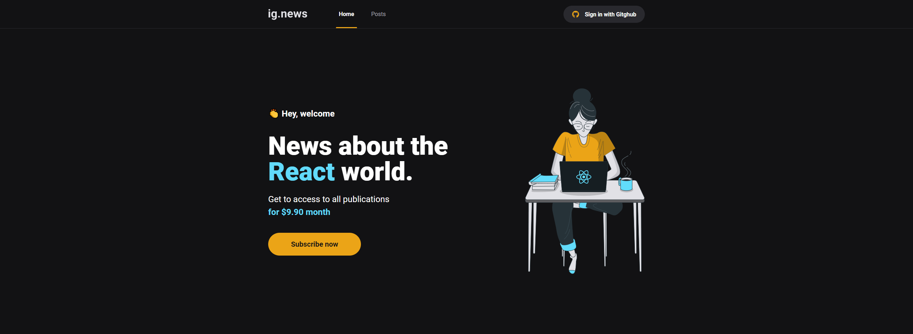
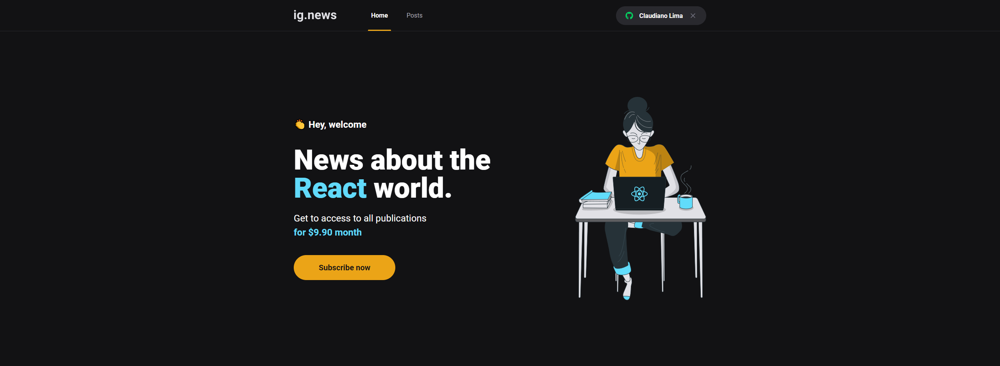
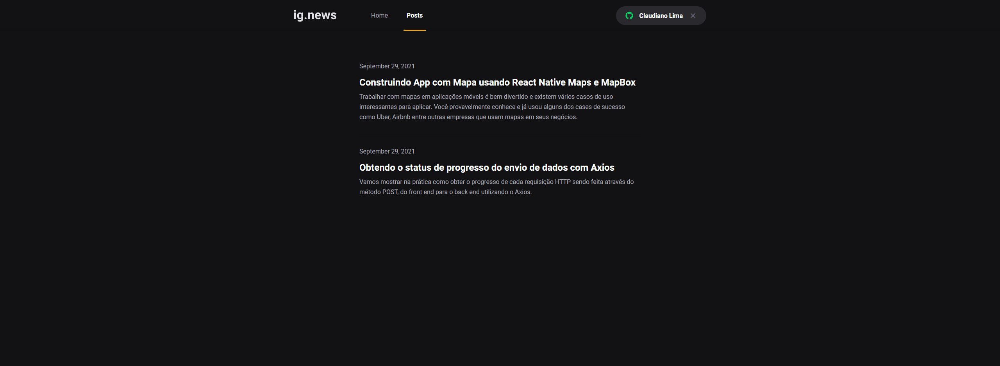
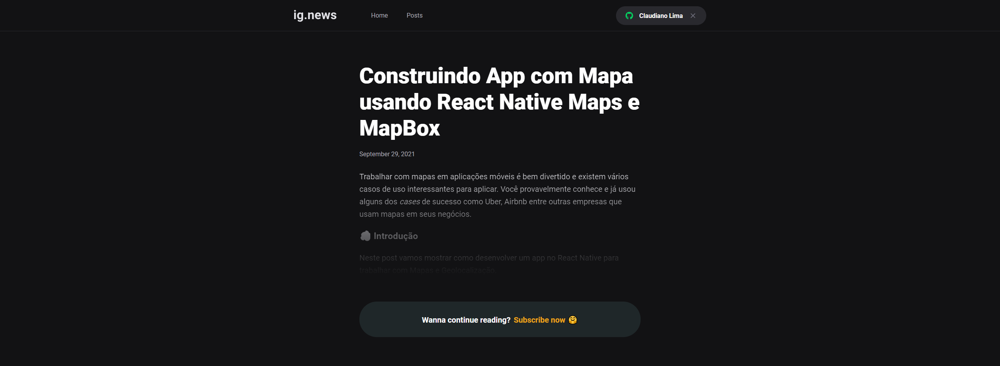
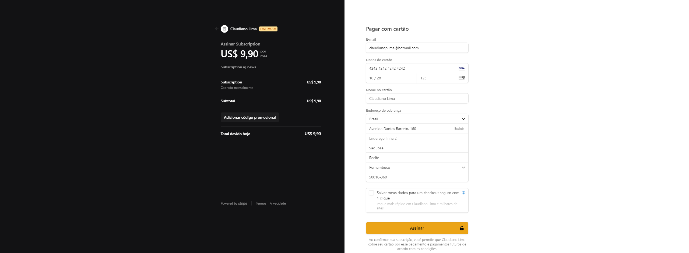
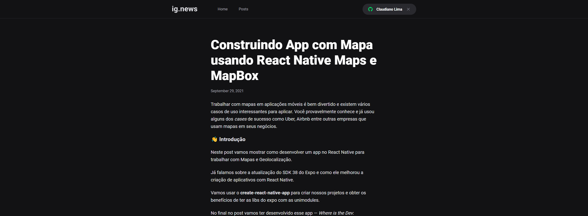

<h1 align="center">
  
</h1>

<h3 align="center">
  Ig.news — Seu portal de tecnologia
</h3>

<p align="center">
  <a href="https://rocketseat.com.br">
    
  </a>
  <a href="https://www.linkedin.com/in/claudianopl/">
    
  </a>
</p>

<p align="center">
 <a href="#-sobre">Sobre</a> |
 <a href="#-layout">Layout</a> |
 <a href="#-requisitos">Requisitos</a> | 
 <a href="#-tecnologias">Tecnologias</a> | 
 <a href="#%EF%B8%8F-como-executar">Como executar</a> | 
 <a href="#-licença">Licença</a> | 
</p>

## 🚀 Sobre
<p align="center">
  
</p>
<p align="left">
O projeto ig.news é um blog onde os usuários podem ter acesso ao conteúdo de cada postagem conforme o status de sua assinatura.
</br></br>
O blog possui sistema de assinatura mensal integrado com a plataforma de pagamento Stripe. Após realizar pagamento o usuário vai poder ver o conteúdo do blog completo, se ele não for assinante só vai conseguir ver uma prévia do conteúdo.
</br></br>
Junto a isso os dados necessários para verificar se o usuário está com a assinatura ativa é salva todos no FaunaDB, além disso, existe uma rota na API do projeto criado com NextJS é responsável por ouvir o WebHooks do Stripe e alterar os dados do usuário no FaunaDB de active para canceled.
</br></br>
Além disso, para fazer todo o conteúdo do blog foi usado o JAMStack Primisc que funciona como um excelente CMS para blog.
</p>

## 🎨 Layout
- Link para video do projeto [**Clique aqui**](https://drive.google.com/file/d/132xr23t9aBgVmvI6-uZXMKwGdowfxUNU/view)
<p align="center">
  
  
  
  
  
  
</p>

## 📚 Requisitos
- Ter [**Git**](https://git-scm.com/) para clonar o projeto.
- Ter [**NodeJS**](https://nodejs.org/en/) para rodar o projeto em NextJS
- Ter [**Yarn**](https://classic.yarnpkg.com/en/) para instalar as dependências

## 🚀 Tecnologias
<h3>Front-end</h3>

- [ReactJS](https://github.com/facebook/react)
- [TypeScript](https://github.com/microsoft/TypeScript)
- [NextJS](https://nextjs.org/)
- [next-auth](https://next-auth.js.org/)
- [Axios](https://www.npmjs.com/package/axios)
<h3>Back-end</h3>

- [Prismic](https://prismic.io/)
- [FaunaDB](https://fauna.com/)
- [Stripe](https://stripe.com/br)

## ⚙️ Como executar
💡 Como o back-end está em serverless não é necessário executar nenhuma configuração separada para ele.
</br></br>
⚠️ <strong>OBS:</strong> Quando clonar a aplicação não se esqueça de:
- Criar um arquivo .env com os seguintes dados:
  - Stripe
    - STRIPE_API_KEY
    - NEXT_PUBLIC_STRIPE_PUBLIC_KEY
    - STRIPE_SUCCESS_URL=http://localhost:3000/posts
    - STRIPE_CANCEL_URL=http://localhost:3000/
    - STRIPE_WEBHOOK_SECRET
  - Github
    - GITHUB_CLIENT_ID
    - GITHUB_CLIENT_SECRET
  - FaunaDB
    - FAUNADB_KEY
  - Prismic CMS
    - PRISMIC_ENDPOINT
    - PRISMIC_ACCESS_TOKEN

```bash

    # Clonar o repositório
    $ git clone https://github.com/claudianopl/IgNews.git

    # Navegar para o diretório
    $ cd IgNews

    # Instalar as package
    $ yarn

    # Execute a aplicação em modo de desenvolvimento
    $ yarn dev

    # Se quiser ver as WebHooks do stripe execute em um terminal separado
    $ stripe listen --forward-to localhost:3000/api/webhooks

    # A aplicação será aberta na porta:3000 - acesse http://localhost:3000
    
```

## 📝 Licença
Esse projeto está sob a licença MIT. Veja o arquivo [LICENSE](LICENSE.md) para mais detalhes.

---

<p align="left">
Feito com 💜 by Claudiano Lima
<p>

<p align="right">
  
  &nbsp;&nbsp;&nbsp;&nbsp;&nbsp;&nbsp;
  
</p>
